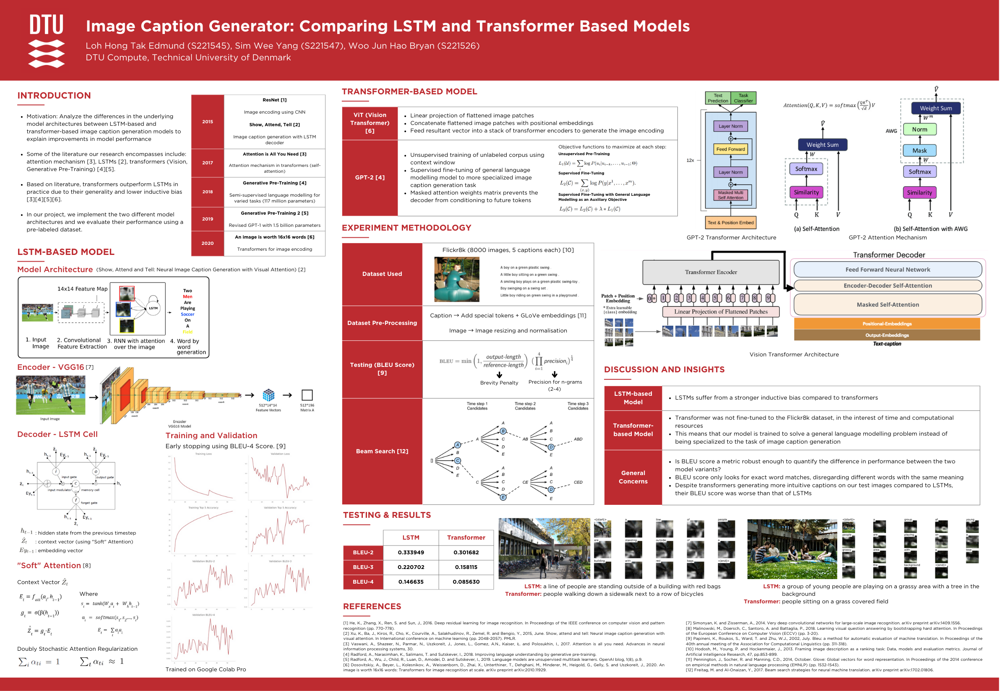

<!-- PROJECT POSTER -->
 

     
     

  <h1 align="center">Image Caption Generator: An Explorative Comparison between LSTM and Transformer Implementations</h1>

  

     
    <a href="https://github.com/othneildrew/Best-README-Template"><strong>View the report »</strong></a>
     
  

### Table of Contents

<ol>
<li><a href="#authors">Authors</a></li>
<li><a href="#codes-and-resources-used">Codes and Resources Used</a></li>
<li><a href="#getting-started">Getting Started</a></li>
<li><a href="#usage">Usage</a></li>
<li><a href="#acknowledgements">Acknowledgements</a></li>
</ol>

 

<!-- ABOUT THE PROJECT -->

# About The Project

Computer vision continues to develop and new technologies continue to push the state-of-art. To stay ahead of the competition, modern businesses are rapidly integrating these new technologies into their workflow. Our group decided to analyse potential business use cases of different variants of image caption generation models over the past decade. We decided to compare older image caption generation models built upon LSTM architectures to their more modern transformer-based counterpart. Depending on the underlying model architecture, these models can be adapted and deployed in business, marketing, or healthcare contexts to streamline existing operations and/or improve workflows. In this project, we compare the architectures of two image caption generation models: one using Long Short-Term Memory (LSTM) and another with transformers. Our study will highlight the strengths and trade-offs of these architectures in the business context of image caption generation. We first introduce and analyse these two architectures in great detail before discussing the various training procedures and shortcomings of our approach.

(<a href="#top">back to top</a>)

### _Keywords:_

_Deep Learning, Image Caption Generation, Transformers, LSTM, Flickr8k, NLP_

## Authors:

- Loh Hong Tak Edmund
- Sim Wee Yang
- Woo Jun Hao Bryan

(<a href="#top">back to top</a>)

## Codes and Resources Used

**Python Version:** 3.8.10

**Built with:** [Google Colab Pro](https://colab.research.google.com/)

**Notable Packages:** matplotlib, numpy, pandas, pickle, great_expectations, tqdm, skimage, torch, nltk

(<a href="#top">back to top</a>)

<!-- GETTING STARTED -->

## Getting Started

This repository contains 2 notebooks:

1. Project_Notebook_LSTM.ipynb
2. Project_Notebook_Transformer.ipynb

Each notebook executes the tasks related to LSTM and Transformers models respectively. The two models were made with separate notebooks for clearer differentiation of the two models.

You will also need to download the Flickr8k dataset, which contains 8091 images and their corresponding captions. This folder containing the images and captions should be called 'flickr_8k_dataset'. Upload this folder into a folder called 'data' on your root directory of Google Drive.

You can download the Flickr8k dataset [here](https://www.kaggle.com/datasets/adityajn105/flickr8k).

Create a folder called 'unseen' in the 'flickr_8k_dataset' folder. This will contain the inference images later.

Overall, your file directory on Google Drive should look like this:

├── drive/My Drive

│ data

│ └── flickr_8k_dataset

| ├──├── images (folder containing training and test images)

| ├──├── captions.txt

| ├──├── unseen (folder containing inference images)

### Prerequisites

We recommend running the project notebooks on Google Colab as the environment on Google Colab has been already set up for Torch related programmes. Also, training and testing the models require large compute power, which is not feasible for small local machines.

(<a href="#top">back to top</a>)

<!-- USAGE EXAMPLES -->

## Usage

### Training

To train the LSTM Model, simply run the relevent cells as annotated in the Notebook. The Transformer model requires no training as the transfer learning of a pre-trained transformer model was used.

### Infering New Photos

If you have not created an 'unseen' folder in the 'flickr_8k_dataset' folder, do create a new folder called 'unseen'. Upload the image that you would like to infer the caption of in this folder. After that, run the relevant cells in the notebook as annotated.

(<a href="#top">back to top</a>)

<!-- LICENSE -->

## License

Distributed under the MIT License. See `LICENSE.txt` for more information.

(<a href="#top">back to top</a>)

<!-- ACKNOWLEDGMENTS -->

## Acknowledgments

We would like to thank Professor Ole Winther of the Technical University of Denmark for the opportunity to embark on this project. We would also like to thank sgrvinod for his baseline implementation of the LSTM decoder mechanism.

(<a href="#top">back to top</a>)

